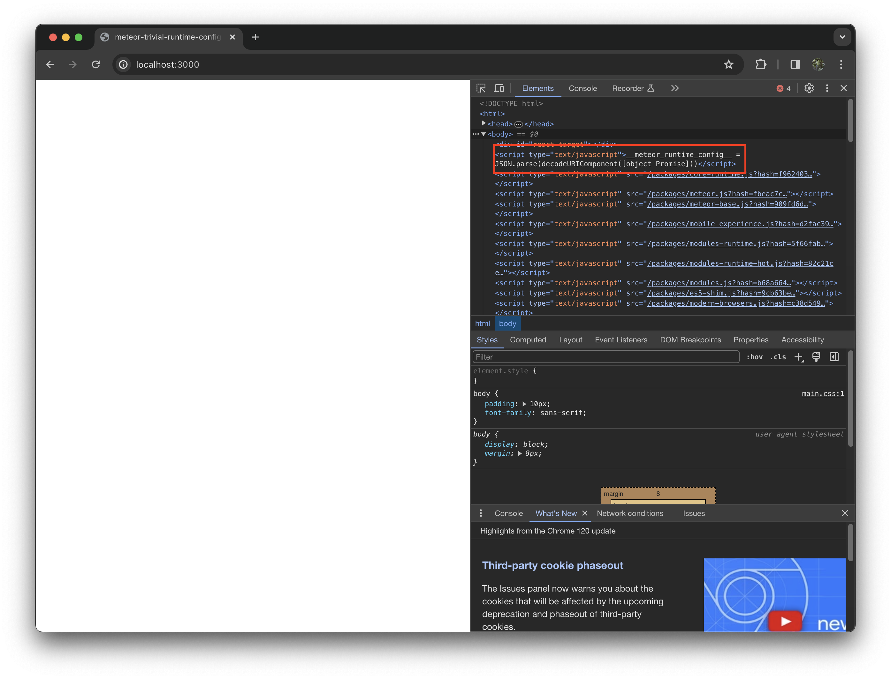
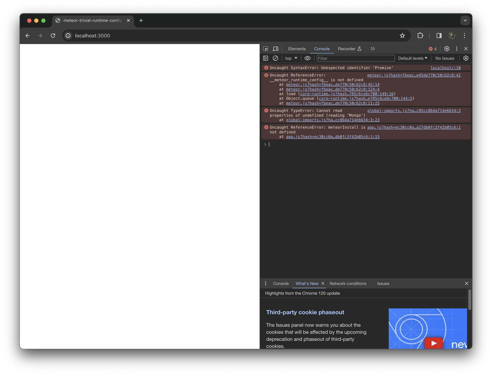

This is a repository demonstrating an issue in the Meteor 3 beta's handling of
`WebApp.addRuntimeConfigHook()`.

It was created by:

* running `meteor create` and checking in the generated project
* running `meteor update --release 3.0-beta.0` and checking in the changed files
* importing `WebApp` and adding `WebApp.addRuntimeConfigHook(() => {});` to server/main.js

If you run `meteor` in the root of this repository and load
http://localhost:3000 in your browser, the page will fail to load,
as the page source, rather than containing a reasonable string to decode for
`__meteor_runtime_config__`, attempts to decode `[object Promise]`:

with errors:

